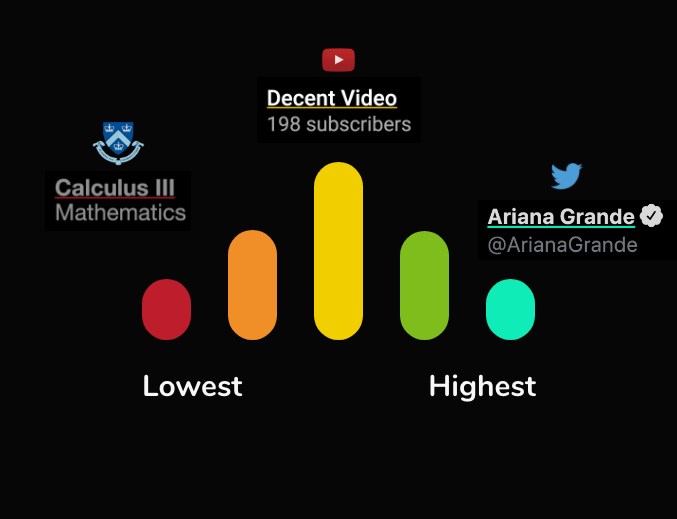
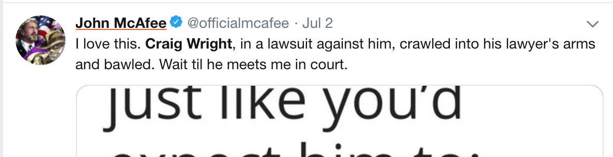

# Colori

Yup mostra il valore sociale tramite colori che sottolineano i contenuti e gli utenti classificati nell'estensione e nell'applicazione web. Ogni colore rappresenta un valore percentile in relazione a qualsiasi cosa presente nella categoria.

## Schema colori

Attualmente esistono cinque colori:

1. Verde acqua: top 20%
2. Verde: 20 - 40%
3. Giallo: 40 - 60%
4. Arancione: 60 - 80%
5. Rosso: 80 - 100%

**Per esempio, il colore del 'tweet' più apprezzato socialmente sarebbe verde o verde acqua.**

**...E quello meno apprezzato sarebbe rosso.**

I contenuti diventano più verdi quanto vengono valutati positivamente e più rossi quando vengono valutati negativamente, riflettendo così un incremento o un decremento nel proprio valore sociale.

**Avanzato**

Ogni contenuto può avere un colore differente per OGNI categoria. All'interno di ciascuna categoria, quel contenuto viene comparato con gli altri presenti al suo interno.

## Conclusioni

Ci auguriamo che, con il passare del tempo, ogni contenuto sia sottolineato con il colore che rappresenta accuratamente il suo valore sociale in base alle opinioni della online community. Vedi [Categorie](categories.md)