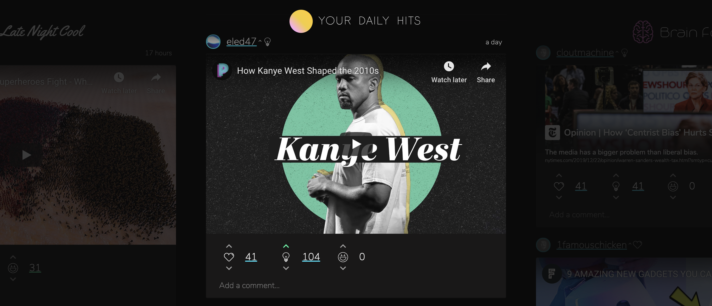

# App

## Feed

Il feed è il culmine dei migliori contenuti di Internet, curati in modo da adattarsi ad uno specifico argomento o stato d'animo. Include contenuti multimediali come tweet, video di Youtube, brani SoundCloud, Subreddit e molti altri. Attualmente, esistono 5 feed tra cui è possibile scegliere. Prossimamente gli utenti potranno personalizzare i propri feed in base ad argomenti, accounts o cerchie di conoscenze.

**Profilo**

Tramite il feed, puoi controllare il tuo profilo e quelli di altri utenti. Hai la possibilità di modificare la tua immagine profilo, il tuo nome completo, e la tua biografia cliccando EDIT PROFILE quando visiti la pagina dedicata al tuo profilo.

## Elenchi

Gli Elenchi raggruppano le opinioni degli Yupster in classifiche che ti aiutano nella ricerca dei migliori contenuti valutati su Yup. Cerca le persone più intelligente su Twitter, i post più divertenti su Reddit, i professori meglio informati, e altro ancora. Gli Elenchi sono completamente pubblici - non necessiti di un account Yup per poterle utilizzare! Filtra per sito, argomento e categoria per trovare ciò che stai cercando.

**Avanzato**  
Gli Elenchi sono **pesati** per ciascuna categoria in maniera separata e distinta. Ciò significa che l'utilizzo e l'influenza che vengono spesi in una categoria determinano la sua rilevanza in quello specifico elenco.