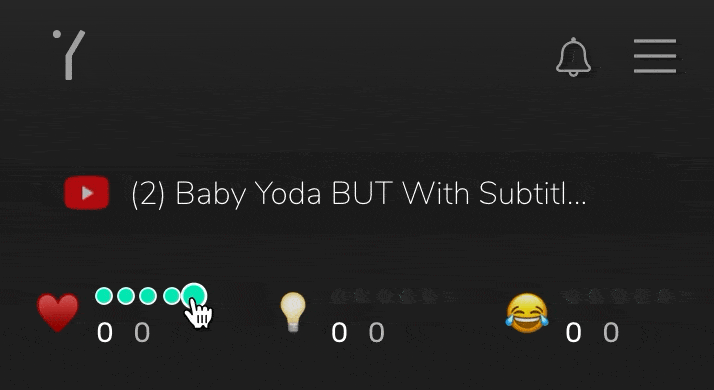
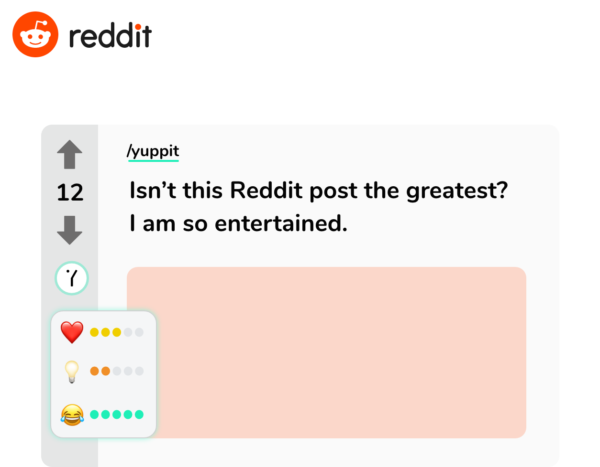
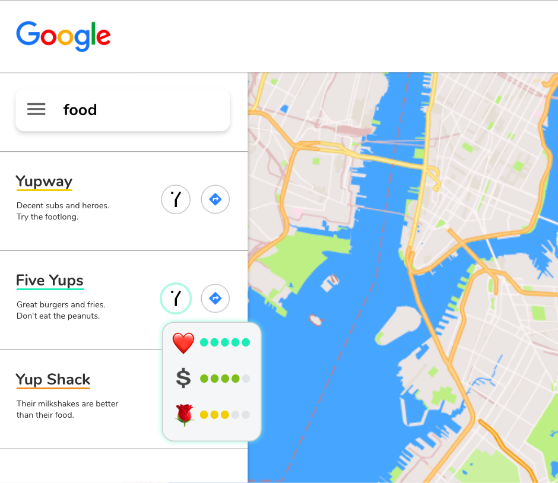

# Estensione

## Estensione di Yup

[Estensione](https://chrome.google.com/webstore/detail/yup/nhmeoaahigiljjdkoagafdccikgojjoi)

Yup è un network che ti ricompensa in base alla qualità delle tue opinioni. L'obiettivo è quello di creare uno strato di consenso sociale nell'internet, che rappresenti accuratamente il concordato valore sociale di qualsiasi cosa, da tweet casuali al tuo professore di storia. Quindi, Yup ricompensa i suoi utenti in proporzione al valore sociale delle loro contribuzioni. Tramite l'estensione di Yup, puoi guadagnare mentre navighi su internet. Tutto quello che devi fare è esprimere una valutazione tramite l'estensione, oppure direttamente su Twitter, Reddit, Youtube, o Google Maps. La tecnologia è complicata, ma il modo in cui funziona è semplice.

L'estensione è un plug-in del browser che ricompensa le opinioni degli utenti sul web.

L'estensione Web di Yup è un web browser plug-in che ti da la possibilità di esprimere la tua opinione su qualsiasi sito su internet. Puoi fare ciò esprimendo una valutazione in una scala 1-5 in categorie come ‘popolare’, ‘intelligente’, ‘divertente’. Quando altri utenti esprimono la stessa opinione sullo stesso contenuto, guadagni YUP ed influenza! Nello Yup network, non tutte le valutazioni sono create uguali. [Scopri di più](rating.md)

Scopri di più: [YUP](https://github.com/Yup-io/yup_docs/tree/24938ac610bbd465109806ec69fb9e97054f2399/token.md) \| [Influenza](https://github.com/Yup-io/yup_docs/tree/24938ac610bbd465109806ec69fb9e97054f2399/influence.md) \| [Categorie](https://github.com/Yup-io/yup_docs/tree/24938ac610bbd465109806ec69fb9e97054f2399/categories.md) \| [Ricompense](rewards.md)

Su determinati siti, le informazioni e le funzionalità di Yup sono fornite tramite un overlay, per garantire un miglior utilizzo.

    

L'estensione funziona sia come uno strumento per le azioni relative a Yup, sia come account crypto. Puoi utilizzarla cliccando sull'estensione stessa oppure utilizzando i bottoni dell'overlay su determinati siti che sono supportati. Inoltre, puoi utilizzare reazioni tradizionali \(per esempio, i like di Twitter, gli upvote di Reddit, i rating di Gmaps\) e queste saranno trattate anche come valutazioni espresse su Yup.

Scopri di più: [Valutazione](https://github.com/Yup-io/yup_docs/tree/24938ac610bbd465109806ec69fb9e97054f2399/rating.md) \| [Specifiche](https://github.com/Yup-io/yup_docs/tree/24938ac610bbd465109806ec69fb9e97054f2399/specs.md)

Conserva YUP per incrementare la tua influenza e le tue ricompense.

I token YUP possono essere inviati ad amici e ad altri account. Ma non inviarli tutti! Contribuiscono al valore dell'Influenza, la quale può farti guadagnare più ricompense in futuro.

Scopri di più: [Influenza](https://github.com/Yup-io/yup_docs/tree/24938ac610bbd465109806ec69fb9e97054f2399/influence.md) \| [Ricompense](rewards.md)

**Requisiti:** _Chrome_, _Opera_, _Brave_, or _Firefox_ browsers. **Funziona con:** Qualsisi sito Internet! **Overlay** \(al momento\) **on :**

1. Twitter
2. Reddit
3. Google Maps
4. YouTube
5. SuperRare

