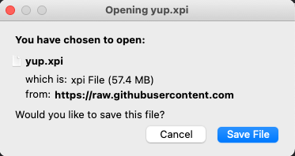

# Firefox Add-On

## 🦊  [Download Firefox Add-On](https://github.com/Yup-io/yup_docs/raw/master/yup.xpi)

### Guida veloce: 

1. [Download Yup Firefox Add-On](https://github.com/Yup-io/yup_docs/raw/master/yup.xpi) dal precedente link.
2. Scegli di aprire il file in Firefox.
3. Concedi i permessi.

