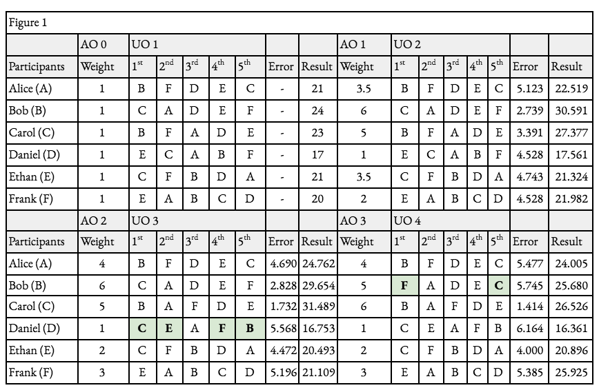

# Protocollo Yup

## Protocollo

Il protocollo Yup è un protocollo di consenso sociale incentivato da un'economia basata sulle opinioni che si trova al di sopra dell'Internet. Stabilisce l'infrastruttura per una nuova forma di social network. Gli utenti ricevono token ricompensa e incrementano la loro influenza nella piattaforma esprimendo valutazioni, postando e curando contenuti. L'impatto delle loro valutazioni, l'influenza e le ricompense che ricevono sono proporzionali al loro valore, determinato dagli altri utenti. Le risorse accumulate tramite lo staking, l'impegno e l'approvazione determinano l'impatto delle loro valutazioni. Il meccanismo del livello sociale costruisce la governance gerarchica del protocollo, risolvendo importanti problemi di identità sociale, garantendo una rappresentazione dei media accurata e trasparente e una monetizzazione/proprietà equa delle informazioni personali. Azioni frazionate di account e comunità governate online promuoveranno mercati equi di creazione di comunità, di intrattenimento, e di sostegno. Il network esiste all'interno del framework del protocollo.

Yup è un protocollo di consenso sociale che facilità la misura, l'acquisizione, e lo scambio di capitale social in un'economia anonima, e allo stesso tempo trasparente, basata sulle opinioni. Identifica contenuti e distribuisce ricompense in base al valore \(influenza\) delle opinioni associate a quel contenuto. In questo caso, definiamo contenuto qualsiasi dato specifico online che gli utenti ritengono degno di giudizio, per esempio, ma non solo, testi, immagini, video, luoghi, account, e link. La metrica dell'influenza è una finzione di coinvolgimento, proprietà nel tempo, e reputazione \(vedi [influenza](../products/glossary-+-citations.md#glossary)\). Il processo decisionale ed il ridimensionamento della piattaforma saranno determinati dalla comunità che serve.

Il protocollo Yup fornisce:

1. _Trasparenza_ di account, e strumenti di filtraggio in base alla loro influenza;
2. _Monetizzazione equa e diretta_ di opinioni, influenza, e contenuti tramite la libera partecipazione;
3. _Entità digitali_ con capitale sociale in gioco;
4. Codici di condotta _guidati dalla comunità_;
5. _Governance della rete_ determinata dall'influenza diretta;
6. _Equa distribuzione_ degli introiti pubblicitari;
7. _Proprietà affidabile_ dell'impronta di rete;

L'entità di tali vantaggi dipende principalmente dalle dimensioni del network che partecipa in questo protocollo. Nella sezione successiva, spiegheremo quali sono i componenti che compongono il protocollo Yup e come realizzano i vantaggi menzionati in questa sezione.

### Token YUP

Il token YUP è progettato per essere una risorsa crittografica fungibile utilizzata per interagire con il protocollo Yup. Nuovi token sono generati secondo un programma rigido e predeterminato. Il meccanismo di ricompensa dei token genera nuovi token YUP e li distribuisce in base all'algoritmo dell'influenza e le quote LP. Lo scambio di asset dell'account permette ai migliori accounts di distribuire e vendere porzioni del loro account in token non-fungibili.

#### Fornitura e Distribuzione

9.315.081 YUP sono generati alla genesi e saranno accessibili nel corso di 1 anno. L'allocazione iniziale di un anno è la seguente:

* 50% a Creatori e Curatori Yup = 4,657,540 YUP
* 23% ai Fornitori di Liquidità = 2,142,469 YUP
* 22% alla Squadra = 2,049,317 YUP
* 5% alla Tesoriera = 465,754 YUP

**Le emissioni occorreranno in 4 fasi:**

**Fase 0 • Giorno 1:** i possessori di token YUPX riceveranno immediatamente una distribuzione retroattivi di YUP ad un tasso 1:1. In aggiunta, più di 10 mila utenti Twitter riceveranno una distribuzione proattiva di YUP in base alle loro azioni su Twitter negli ultimi mesi e alle valutazioni di utenti Yup ricevute. Infine, ~20% di questo sarà trattenuto per ricompense creatori non riscosse e il 15% sarà trattenuto dalla squadra. _Questo creerà una fornitura iniziale di 100.000 YUP_.

**Fase 1 • 1 Anno:** Emissioni giornaliere pari al 1,25% della fornitura totale di YUP
Giorno 1: 1.250

Giorno 2: 1.266

Giorno 3: 1.281

ecc...

**Fase 2 • 1,049 Giorni \(2.88 Anni\):** Emissioni giornaliere decrementati di 100 YUP ogni giorno fino a 10.000 YUP al giorno.

**Fase 3 • indefinitamente:** Emissioni giornaliere di 10.000 YUP

### Meccanismo delle ricompense

I componenti che costituiscono il capitale sociale e l'influenza nel network sono principalmente incorporate nel meccanismo delle ricompense del protocollo, eccezion fatta per il livello sociale (social level) \(vedi {\it Livello Sociale\/}\). Nel \gls{protocollo Yup}, una buona parte dei token generati sono distribuiti proporzionalmente a contenuti che producono azioni di valore. Questa frazione prende il nome di allocazione di creazione (creation allocation) Y\textsubscript{c}. Definiamo il valore dell'azione (action value) V\textsubscript{h} come il valore in token di un'azione. Definiamo la ricompensa di creazione (creation reward) R come il valore in token \(Y\) di una creazione individuale \(contenuti di qualsiasi forma, identificati numericamente\). Pertanto, l'allocazione di creazione di un determinato periodo t è uguale alla somma di tutte le corrispondenti ricompense di creazione, e ciascuna ricompensa di creazione corrisponde alla somma del valore delle sue azioni, dove j è un insieme ordinato di quelle azioni,

$$
Y_{c,t}  = \sum_{i=1}^{n} R_{i} \quad i.e.\  \quad \exists n \quad R \quad \forall t
$$

$$
R_i =\sum_{j=1}^{m} V_{j} \quad i.e.\  \quad \exists m \quad \forall R
$$

$$
Y{c,t} = \sum{i=1}^{n} \sum{j=1}^{m} V{ij}
$$

Nota che ogni azione ha un differente valore V. Tale valore è determinato dall'influenza delle sue azioni come frazione dell'influenza totale di tutte le sue azioni nel network in un determinato periodo di tempo t. Definiamo I\textsubscript{i} come l'influenza di un individuo su un'azione e $$I_{\overline{i}}$$ come l'influenza totale dell'insieme di azioni in ciascun intervallo temporale di creazione. Il valore di un'azione è calcolato come,

$$
V_{h} = \frac{I_i} {I_{\overline{i},t}} Y_{c, t}
$$

### Influenza

L'influenza è una metrica utilizzata per regolare la distribuzione dei token ricompensa, la governance del network, la rappresentazione trasparente del valore sociale e dell'impegno nel network, piuttosto che staking di token. Il suo scopo è riflettere il valore sociale di un utente più accuratamente rispetto ai voti 1-per-1 o ai semplici schemi ponderati per token. Per valutare l'influenza dell'interazione di ciascun utente, insieme alla loro ricompensa e al potere di voto (voting power) nel network, il protocollo Yup determina l'influenza di ciascun indirizzo secondo una rigida funzione dell'influenza, definita come,

$$
I=\beta_1 \sqrt{A} +\beta_2 \sqrt{a}  +\beta_3 \sqrt{s}  +b
$$

#### Età della moneta (Coin Age)

Per un consenso robusto, i token posseduti da un account sono rappresentati dall'età (age) A in un modo che si contraddistingue dallo staking. Nei meccanismi proof-of-stake convenzionali, è necessario che vi sia una chiara delimitazione tra i token in stake e quelli non in stake. Un differenziatore importante è il ritardo di prelievo, o il periodo di tempo predeterminato in cui il deposito di token di un miner è bloccato dopo che inviano un “messaggio di prelievo” e iniziano ad effettuare lo un-staking. Questo è vitale per determinare a cosa Ethereum Foundation si riferisce con il termine “dynasty (IT: dinastia)”, o insieme di miner e i loro token in stake per un certo periodo di tempo. @casper In aggiunta, questo rende lo staking come un impegno in tempo ed un impegno in capitale. Per un protocollo come quello di Yup, dove la storia degli investimenti nel network è degna di nota, è utile riflettere in maniera diretta da quando tempo i token sono detenuti. Descriviamo un nuovo uso del concetto di età del token come era originariamente in Peercoin @peercoin, la prima implementazione del proof-of-stake, per cui un token necessitava di possedere un'età di almeno 30 giorni \(30 giorni di blocchi devono essere confermati a partire dal blocco della transazione in input\) affinché venisse utilizzato per il consenso, questo non rappresenta accuratamente l'impegno all'interno del network delle parti interessate. Un account che detiene 10 token per 30 giorni, ed un altro account che detiene 10 tokens per 3 anni hanno la stessa probabilità di estrarre un blocco Peercoin e conseguentemente hanno la stessa influenza nel consenso. Il protocollo Yup porta l'età del token al passo successivo e gli attribuisce valore diretto all'interno del consenso. Per ottenere ciò, definiamo Età (Age) A come la somma del valore in token di ciascuna transazione in input \(k1, k2 , … kn \) moltiplicato per il numero di blocchi o periodi da quando la transazione è avvenuta. E' espressa come,

$$
A  = \sum_{i=1}^{n} Y_i t_i
$$

Questo fornisce numerosi vantaggi. Primo, riflette accuratamente l'impegno di un utente nel network, tenendo in considerazione per quanto tempo hanno posseduto i loro token. Questo previene che nuovi arrivati o individui con cattive intenzioni incrementino considerevolmente la loro influenza tramite l'acquisto di token in un breve periodo di tempo. Secondo, siccome il protocollo Yup viene eseguito su un registro distribuito esistente, l'ordinamento delle transazioni e delle dinastie definite non è necessario. Questo permette al protocollo di sostituire completamente lo staking e il processo di prelievo, grazie alla funzione dell'età e senza ridurre la sicurezza o la stabilità. Terzo, struttura il tempo come una risorsa in gioco per i partecipanti, che potrebbe essere ridotta in seguito a comportamenti bizantini, simile a come la riduzione dei token funziona in PoS. @vitalik Per esempio, un utente che agisce in maniera scorretta potrebbe ricevere una riduzione percentuale, temporanea o permanente, dei suoi token. Conseguentemente saranno ridotte anche la sua Età e la sua Influenza \(vedi la sezione _Governance_ per altre informazioni\)

#### Attività

In aggiunta all'Età, la contribuzione alla rete è una metrica importante per valutare il capitale sociale, tuttavia è difficile misurarla. Utilizziamo le ricompense in token YUP come un modo trasparente per determinare tale contribuzione. Disaccoppiamo i token guadagnati e quelli acquistati, misurandoli in maniera distinta e attribuendogli un valore separato. Questo include ricompense ricevuto sia per la cura di contenuti che per la creazione di contenuti. Definiamo Ru,i come le ricompense ricevute da token YUP recentemente coniati per ciascuna azione _i_ effettuata da un utente/account specifico _u_. Definiamo Attività (Activity) _a_ come una rappresentazione del valore delle contribuzioni di un account al network, misurando le ricompense che tale account ha ricevuto da coinvolgimenti precedenti. Da un punto di vista matematico, è la somma di tutte le ricompense precedentemente ricevuto da un account, la definiamo come,

$$
a  = \sum_{i=1}^{n} R_u,i
$$

Nota che il bilancio di token di un account o l'Età non influenza l'Attività; dovesse un utente spendere o trasferire i suoi token guadagnati, l'Attività dell'account non cambierà. Questo fornisce a partecipanti con poco capitale rendimenti più equi che riflettono le loro contribuzioni al network, indipendentemente dal loro bilancio di token corrente.

Le ricompense ricevuto da coinvolgimenti precedenti sono critiche per la misura dell'Attività di un account,tuttavia la loro influenza marginale sull'Attività diminuisce al suo aumentare. Con questo, il protocollo può valutare appropriatamente il valore di un'attività, in concomitanza al valore di ogni creazione nel suo insieme.

Al fine di scoraggiare un'attività eccessiva e futile, Yup impone una quota di 10 azioni al giorno \(questo può essere cambiato tramite la governance dei token, vedi _Governance_\). Un account può continuare ad interagire con il protocollo anche dopo aver terminato la quota, spendendo le proprie risorse di rete in transazioni futili, ma questo avrà pressoché nessuna influenza e conseguentemente non produrrà alcuna ricompensa, ciò significa nessun incremento dell'Attività. Un motivo per impegnarsi ancora in comportamenti futile è aumentare la visibilità e conseguentemente il livello sociale _s_. Un'altra ragione potrebbe essere per motivi di intrattenimento. Comunque, la funzione di forza fornisce l'Attività con un altro componente di scarsità, riducendo gli incentivi per coinvolgimenti/impegni automatizzati. La distribuzione delle ricompense è un argomento complesso all'interno ed all'esterno della creazione. Discutiamo ora le ricompense divise a ciascun partecipante di una creazione.

#### Ricompense Creatori e Curatori

Analogamente a come la funzione dell'influenza determina il valore di un singolo voto, determina anche l'allocazione delle ricompense associate a ciascun voto. La ricompensa assegnata a ciascun partecipante dipende dalla forma di partecipazione, dall'influenza durante la partecipazione, e dall'ordine relativo della partecipazione. Dalla nostra precedente definizione \(Vedi _Meccanismo delle ricompense_\), possiamo determinare l'attuale ricompensa di un contenuto _R_ come le ricompense totali assegnate ad uno specifico contenuto fino al blocco corrente, identificato numericamente. Definiamo la Ricompensa Creatore Rc come la porzione della ricompensa del contenuto assegnata al creatore del contenuto. In ogni circostanza, il creatore del contenuto riceverà almeno il 50% della ricompensa del contenuto: Rc ≥ $\frac{R}{2}$. La metà rimanente della ricompensa viene distribuita tra il creatore e i curatori, in base all'influenza. Definiamo Ic come l'influenza del creatore all'atto della creazione, e Ii come la somma totale dell'influenza di tutti i partecipanti ad una specifica creazione. La porzione del creatore in questa metà è determinata dal rapporto tra la sua influenza e l'influenza della pool. Quindi Rcr è matematicamente definito come, 

$$
R_{c} = R_{i} (\frac{1 + \frac{I_{c}} {I_{pool, t}}} {2})
$$

_Per esempio, supponiamo di avere una normale creazione che riceve ricompense per un totale di Ұ100. Con un'influenza Icr pari al 20% dell'influenza totale nella pool Ipool, la ricompensa del creatore sarebbe 1+0,22 = 60% \* Ұ100 = Ұ60. Ciò significa che le ricompense restanti, pari a Ұ40, sono distribuite ai curatori._

Ogni curatore riceve ricompense per i voti che sono effettuati successivamente al suo, ma non prima. Per misurare questo effetto a catena nelle ricompense e determinare le ricompense da assegnare a ciascun curatore, utilizziamo una formula simile a quella dello schema delle ricompense creatore, ma con la separazione del valore di azioni individuali _Vj_ in accordo con i curatori che hanno partecipato in precedenza. Definiamo la ricompensa curatore Rq come le ricompense distribuite ad un singolo curatore, Vq come il valore azione designato per l'azione del curatore, e Vh,j come il valore azione del sottoinsieme di tutte le azioni precedenti. L'espressione matematica equivalente è,

$$
R_{q} = (\frac{1 - \frac{I_{c}} {I_{pool, t}}} {2}) \sum_{i=1}^{n} (\frac{V_q} {V_{h,j}}) V_{j}
$$

_Ritornano al nostro esempio di prima, il 40% assegnato ai curatori viene diviso tra di loro. Supponiamo che il VCu di Alice sia Ұ25 e che lei sia stata la penultima curatrice, che il Vcu di Bob sia Ұ50 e che lui sia stato l'ultimo curatore, e che al momento la somma totale dei Vh sia Ұ100. Siccome Alice riceve una porzione delle sole azioni effettuate successivamente alla sua, verrebbe ricompensata solo per l'azione di Bob. Il Rcu di Alice è la porzione di ricompense distribuite agli utenti \(40%\) \* la somma del valore di tutte le azioni successive \(VBob = Ұ50\) \* la frazione del V di Alice su tutte le V che precedono l'azione di Bob \(25/50 = 0,5\) 0,4_50_0,5 = Ұ10. Alice riceverebbe una ricompensa di 10 YUP dall'azione di Bob. In seguito all'azione di Bob, l'influenza della pool è incrementata e la percentuale del creatore è diminuita: 20% → 10%. Se ora Carol effettuasse un'azione dal valore di Ұ100 nella creazione che stiamo considerando, il creatore riceverebbe approssimativamente Ұ55, Alice riceverebbe approssimativamente Ұ7,5, Bob riceverebbe approssimativamente Ұ30, e i curatori precedenti riceverebbero approssimativamente Ұ7,5._

Questo schema di distribuzione delle ricompense fa sì che i curatori ricevano ricompense in token solo da azioni che vengono effettuate successivamente rispetto alla loro, e che ricevano una porzione della ricompensa di ciascuna azione in proporzione al valore della loro azione considerando solo le azioni precedenti. Da un punto di vista economico, questo stimola i curatori ad essere tra i primi a curare contenuti di qualità, e con un alto valore azione, in modo da ricevere ricompense da eventuali azioni successive.

#### Incremento \(Meccanismo di Combustione\)

Al fine di mantenere l'offerta di token Yup in distribuzione ed al fine di incrementare la loro domanda, il protocollo permette agli account di 'bruciare' token Yup permanentemente in cambio di un ‘incremento’ dell'influenza per una specifica azione. Gli utenti possono bruciare un numero di token limitato per aumentare l'influenza della loro azione. Questo può essere rappresentato come il numero di token bruciati insieme ad un moltiplicatore di incremento \(ς\). L'Incremento è definito come,

$$
b = ςYburn, u
$$

### Consenso del Livello Sociale

Yup utilizza un consenso del livello sociale stratificato, per costruire una governance sostenibile all'interno del suo network e per assicurare un'appropriata rappresentazione del valore del network. Questo ordina i partecipanti in base al loro livello sociale riconosciuto. Il loro livello sociale individuale _s̄_ sarà determinato da tutti gli altri indirizzi nel network. Ogni indirizzo ha il suo ordine per tutti gli altri indirizzi, che può manipolare nel modo desiderato. Il peso \(w\) dell'ordine di un utente \(UO\) sarà determinato dal loro livello nell'ordine aggregato \(AO\) del blocco precedente, insieme ad aggiustamenti minori. Il Livello Sociale può essere definito come,

$$
\bar s = \sum_{i=1}\frac{s_i * (log(w_i)+ 1)} {\sqrt[5]{e_p}}$$ e = ∑i = 1(ri − μi)2
$$

Per cui, il posizionamento è soggetto a decremento in base all'errore \(e\) del proprio ordinamento in relazione a quello aggregato. L'errore è determinato dalla somma delle differenze tra ciascun ordinamento, r, ed il corrispondente livello medio di quell'account, _μ_, tutto elevato al quadrato. Questo incentiva i partecipanti ad effettuare ordinamenti onesti, visto che un ordinamento largamente incorretto significherebbe una notevole riduzione del loro livello sociale. Il livello sociale di un indirizzo, che determina il suo peso nei blocchi futuri, è la somma di tutti i punti che ha ricevuto.

* Esempio: Alice, Bob, Carol, Daniel, Ethan, e Frank sono i partecipanti di un network con lo stesso protocollo che abbiamo presentato. I sei utenti si ordinano a vicenda nel ‘blocco di genesi’ della piattaforma che stanno utilizzando \(in ordine dal più alto al più basso\). I loro voti nei round 1, 2, 3, e 4 sono mostrato in Figura 1. Mentre il loro peso nel network era uniforme nel primo turno di voti, nel round 2, i nuovi livelli sociali ed i nuovi pesi dei loro account sono \(A, 3,5\), \(B, 6\), \(C, 5\), \(D, 1\), \(E, 2\), e \(F, 3,5\), pertanto Bob è l'utente più influente e Daniel quello meno influente. Nel round 3, Daniel cerca di incrementare l'influenza di Carol rispetto a Bob, ordinano lei prima e lui ultimo. Sebbene questo faccia aumentare significativamente l'errore di Daniel \(4.528 → 5.568\), porta con successo Carol in prima posizione. Nel tentativo di tornare in cima, Bob ordina Carol molto in basso nel round 4. Sebbene questo riduca significativamente la differenza in livello tra lui e Carol, così come la differenza tra Carol e gli altri utenti, incrementa drasticamente l'errore di Bob \(2.828 → 5.745\). Conseguentemente il suo punteggio finale viene decrementato e ciò previene la supposizione di Carol.

Come mostrato in _Figura 2_, gli ordini aggregati sono derivati da informazioni memorizzate nel blocco precedente. Gli utenti possono effettuare transazioni con la blockchain per alterare il loro ordine di indirizzi pertinenti. A meno che le nuove transazioni non cambino gli ordini degli utenti, questi mantengono il loro stato dal blocco precedente, apparendo relativamente identici. Tuttavia, anche se un indirizzo non apporta modifiche, il loro livello sociale ed il loro peso sono soggetti a cambiamenti in base a spostamenti nell'ordine aggregato, che possono verificarsi come conseguenza di anche solo una transazione. Ci possono essere più categorie, come somiglianza, intelligenza, affidabilità, realtà, ecc.

#### Vantaggi

Ci sono diversi utilizzi per un sistema di livello sociale stabile e dinamico all'interno di un network online di comunicazione e identificazione. Può fornire agli utenti una trasparenza dettagliata su altri account, gruppi, e canali. Può creare barriere incentivate all'ingresso e filtri per la partecipazione all'interno di un feed o una chat di gruppo. Può identificare e prevenire attori malevoli e artificiali, e può prevenire che determinati contenuti ricevano attenzione non necessaria. Può fungere da fondamenta per il processo decisionale e la governance all'interno di comunità di varie dimensioni, dove questi ultimi sono incentivati da capitale sociale piuttosto che da guadagni monetari diretti. Può creare identità digitali intorno ad account di cui ci si può fidare senza la necessità di un intermediario di terze parti. La user experience del livello sociale sarà integrata in altre interazioni sull'applicazione, come voti, commenti e visualizzazioni.
